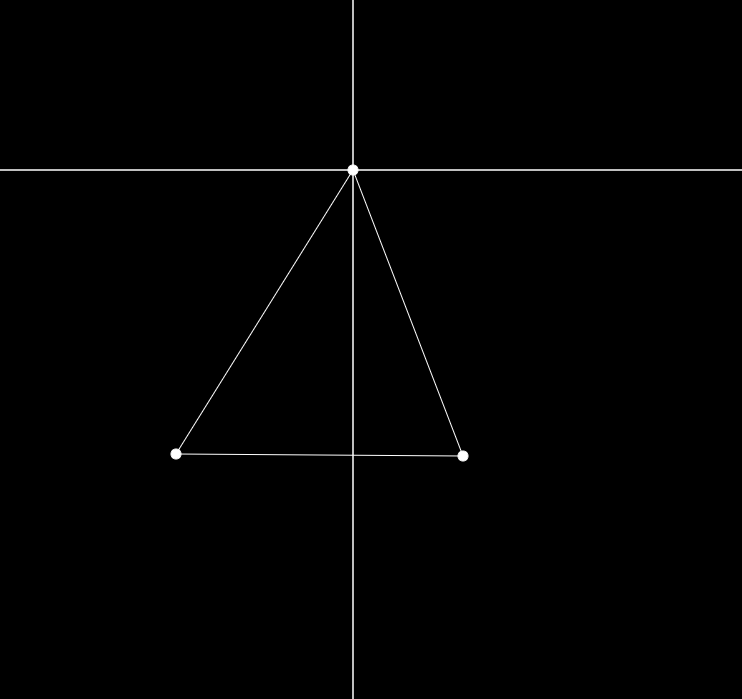
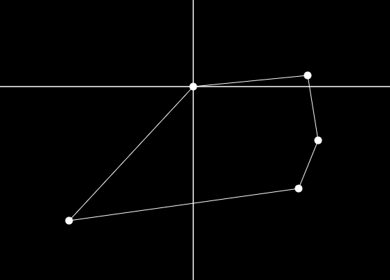
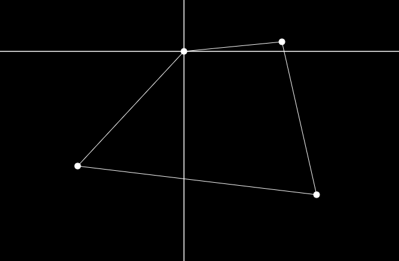

# Lost in Space Perimeter Fence Algortihm

<figure>Fig 1. Perimeter Fence Example</figure>

The perimeter fence played a big rule in the television show, it is what protected the colonists from the alien wildlife. The perimeter was setup 
through individual posts that would be planted in the ground and activated from a mobile device. The individual posts connected with each other and
created an invisible boundary that when touched would shock you.

I wondered what a possible algorithm would be for setting up a fence system such as this, so the first problem is the actual perimeter construction.
So something that came to mind was the concept of the convex hull and the gift-wrapping(jarvis walk) algorithm. The second problem that came up was I
needed a way to find the left most point or fence post as the assumption is that each fence post does not really know where it is relative to the other
points. So the antidote to this problem was I needed a fence post that was different from the rest so I created the Genesis Post.

When placing the Genesis Post we create a cartesian plane with the post as the origin point. When placing the other posts we can calculate their
position relative to the Genesis Post and this we way we can find the leftmost point for the gift-wrapping algorithm.

    

Here we can the genesis point in action, it is the top most point and the lines going through it represent the x and y axis of the plane.
The convex hull/perimeter that is created bu the fence posts can be seen by the lines connecting the points.

The convex hull calculation also allows us to apply some optimizations with the fence perimeter allowing us to use the minimum number of fence
posts. 

    

This is an example of a possible fence post configuration.
Now we may want to extend the perimeter downwards.

    

We placed a fence post to the right and further down, but since the older points are no longer on the convex hull we can remove them and still
have a valid perimeter.

## Test it out
<a target="blank" href="https://skorpion19091.github.io/Perimeter-fence-constructor/">Fence Construction Perimeter</a>
